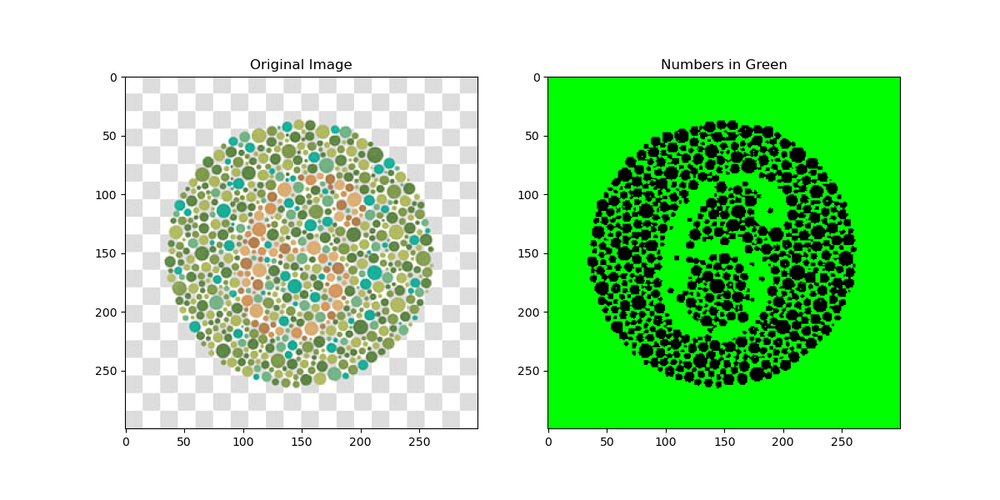
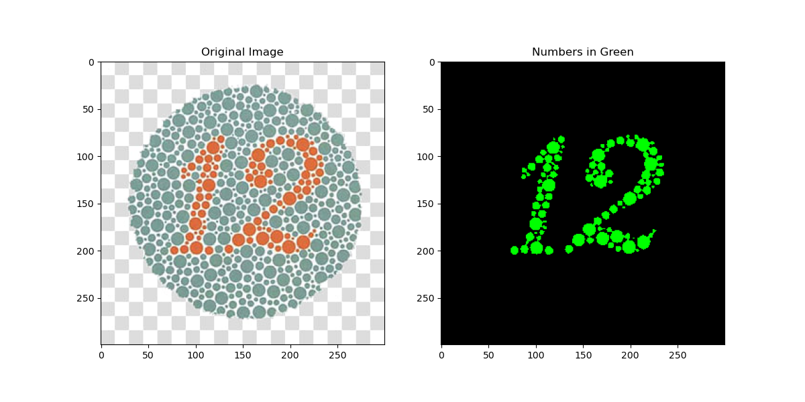
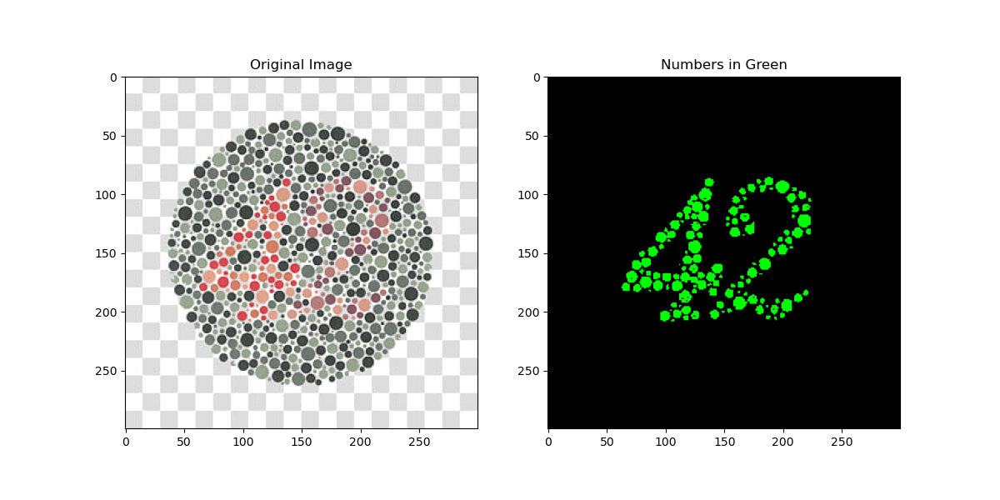
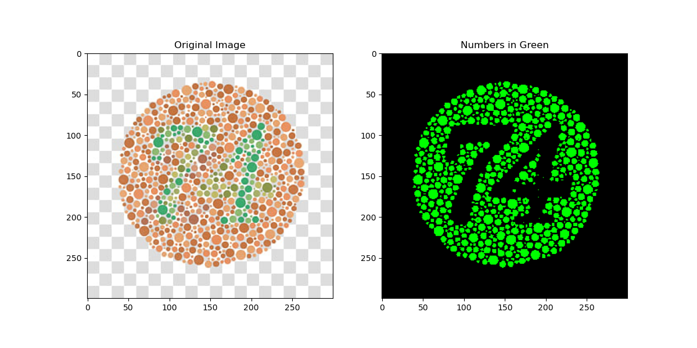

# Ishihara Test Analysis with K-means Clustering

This project implements K-means clustering from scratch and uses it to detect numbers in Ishihara color blindness test images.

## Overview

Ishihara tests are colored plates designed to test color vision deficiencies. People with normal color vision can see numbers in the patterns, but those with color blindness may see different numbers or no numbers at all.

This project implements a custom K-means algorithm from scratch and applies it to detect numbers in Ishihara test images.

## Project Structure

```
.
├── data/                   # Input Ishihara test images
│   ├── 6.jpg               # Ishihara test image containing number 6
│   ├── 12.jpg              # Ishihara test image containing number 12
│   ├── 42.jpg              # Ishihara test image containing number 42
│   └── 74.jpg              # Ishihara test image containing number 74
├── results/                # Output images with detected numbers
├── src/                    # Source code
│   ├── custom_kmeans.py    # Custom K-means algorithm implementation
│   └── image_processor.py  # Image processing utilities
├── main.py                 # Main script to process images
└── README.md               # This file
```

## Requirements

- Python 3.6+
- NumPy
- PIL (Pillow)
- Matplotlib

## Installation

Install dependencies:
```
pip install numpy pillow matplotlib
```

## Usage

Process all Ishihara test images in the data directory:
```
python main.py
```

The processed images will be saved to the `results` directory.

## How It Works

1. **Image Processing**:
   - Convert images from RGB to LAB color space
   - Extract the 'a' channel (green-red) for clustering
   - Normalize the data to improve clustering

2. **K-means Clustering**:
   - Apply the custom K-means implementation with k-means++ initialization
   - Identify the cluster that corresponds to the number in the image
   - Create a visualization with the numbers highlighted in green

3. **Visualization**:
   - Create result images showing the detected numbers in green
   - Save the results for analysis

## Implementation Details

### Custom K-means Algorithm

The custom K-means implementation includes:
- K-means++ initialization for better starting centers
- Lloyd's algorithm for iterative refinement
- Multiple random initializations to find global optima
- Convergence criteria based on centroid movement

## Example Results

Below are examples of the K-means clustering results on Ishihara test images:

### Number 6


### Number 12


### Number 42


### Number 74


*Note: The images above show example results. After running the code, you'll find your actual results in the `results` directory.*

## Algorithm Explanation

The key to extracting numbers from Ishihara plates lies in the color differences. The a-channel in the LAB color space is particularly useful for discriminating between the red/green color variations in these images.

By applying K-means clustering with k=2, we effectively separate the image pixels into two groups:
1. Background dots
2. Number dots

Our algorithm automatically identifies which cluster represents the number and highlights it in green for clear visualization.